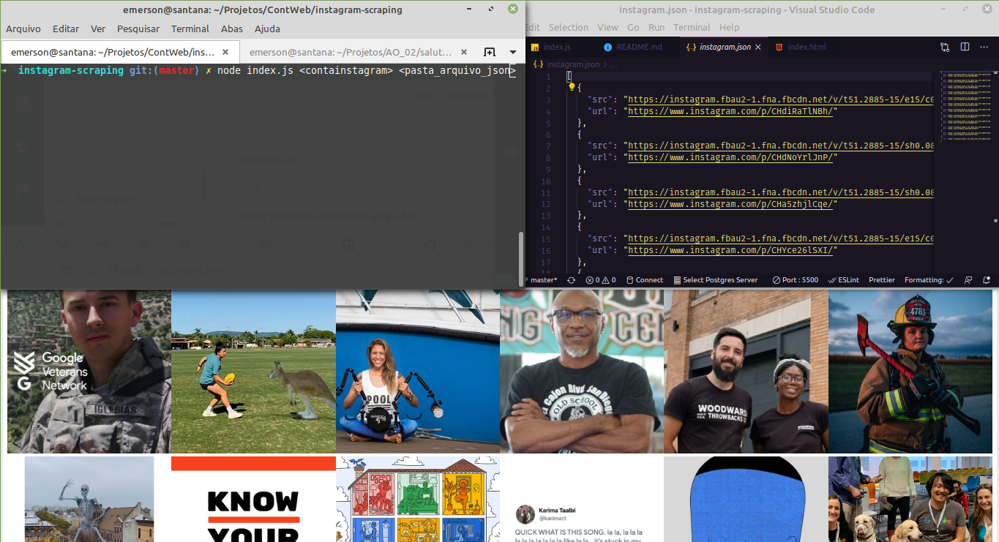

<h1 align="center">INTAGRAM SCRAPING</h1> &nbsp;
<div align="center">
    <h4>Extrair url e src das images do instagram por meio da linha de comando e salvar em arquivo JSON</h4>   
</div>

&nbsp;



&nbsp;

## Obs.: É necessário ter node e npm instalados

&nbsp;

### Clone o projeto

```
git clone https://github.com/emersonfidelon/instagram-scraping
```

### Entre na pasta gerada

```
cd instagram-scraping
```

### Instale as dependências

```
npm install
```

### Rode o comando

```
node index.js <conta_instagram> (<pasta_aquivo_json> opcional)
```

### Exemplo

```
node index.js google
```

### Abra o arquivo index.html no navegador

&nbsp;

### Nota:
O parâmetro <pasta_arquivo_json> serve para alterar salvar o arquivo gerado em uma pasta diferente. Ex:

```
/var/www/html/projeto
```

&nbsp;
### Dica:
Usar o <a href="https://www.hostinger.com.br/tutoriais/cron-job-guia/" target="_blank">CRON</a> para rodar o script automáticamente nos dias e horários definidos por você, mantendo seus posts do instagram sempre atualizados em seu site.


